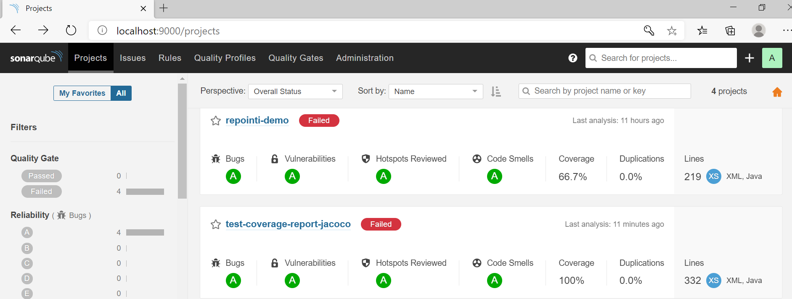

# Jacoco coverage for Multi Module Maven Project

A sample multi modular maven project demonstrating how to met coverage for unit, integration and/or functional testing withing different modules. The test results is aggregated by Jacoco plugin and a merged code coverage report is being generated. The generated code coverage report is uploaded to the sonarqube server running on docker

## Modules

* module1: Java module containing classes along with unit test cases.
* module2: Java module containing classes along with unit test cases.
* test-aggregate: Module to aggregate the coverage reports from all the modules. dfdddd


## Dependencies

* Java 11+
* Maven 3.6.3+
* SonarQube Server 8.6+

## How to build

### Start Sonarqube server in Docker

```
docker run --rm --name sonarqube -p 9000:9000 -v /mnt/c/Albin/blogData/docker-container-files/data:/opt/sonarqube/data -v /mnt/c/Albin/blogData/docker-container-files/logs:/opt/sonarqube/logs -e SONARQUBE_ADMIN_PASSWORD="Welcome1" techforum/sonarqube-with-custom-plugins-aem:latest
```
Change the mountpoint details

### Generate Coverage Report

To generate the aggregated coverage  report run in the project root directory the following command 

```
    mvn clean verify sonar:sonar
```

The aggregated coverage report is genereated under test-coverage-report-jacoco/test-aggregate/target/site/jacoco-aggregate, view the report by opening index.html

The coverage for the individual modules are created under target/site/jacoco.

The aggregated coverage report is uploaded to sonarqube, the report can be viewd from sonarqube once ready.



